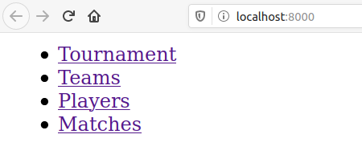
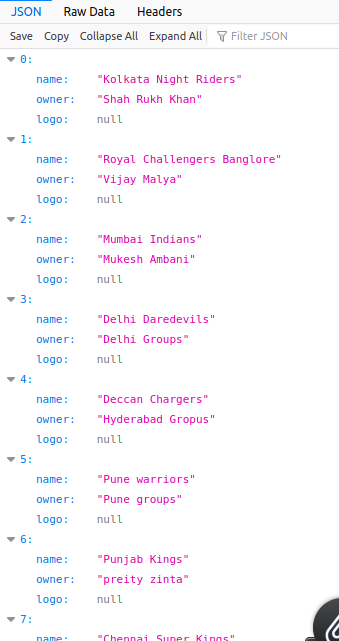

# Steps to Run the Project
1. Clone the repository as `git clone https://github.com/Aman-Dubey/tournament-django.git`
2. Before we start working let us create a virtual environment.
3. If `venv` is not installed on your system please go through [documentation](https://docs.python.org/3/library/venv.html)
4. Create a new virtual environment as `python -m venv venv`
5. Activate the virtual environment as `source venv/bin/activate`
6. Change working directory as `cd tournament-django`
7. Install all the project dependency as `pip install -r requirements.txt`
8. Migrate all the database as `python manage.py migrate`
9. Start the server `python manage.py runserver`
10. The website is ready to be seved on **localhost:5000**

# Screenshot

# About the Project
There are 4 models Players, Teams, Tournament, Match which is accessible through api-end points.
